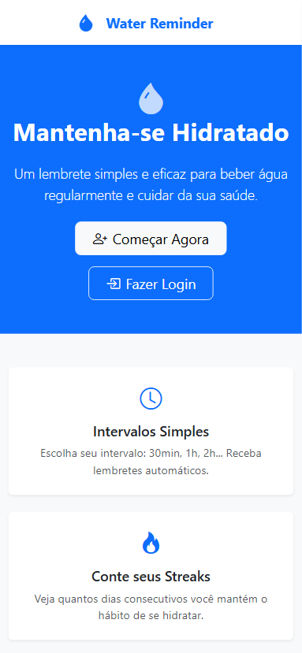
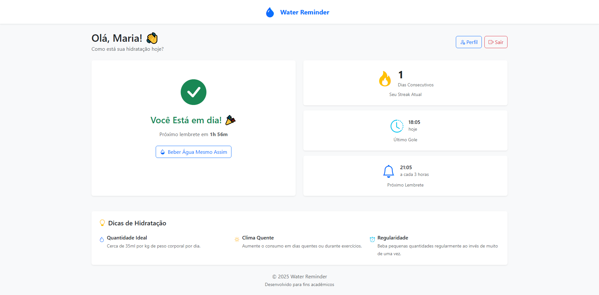
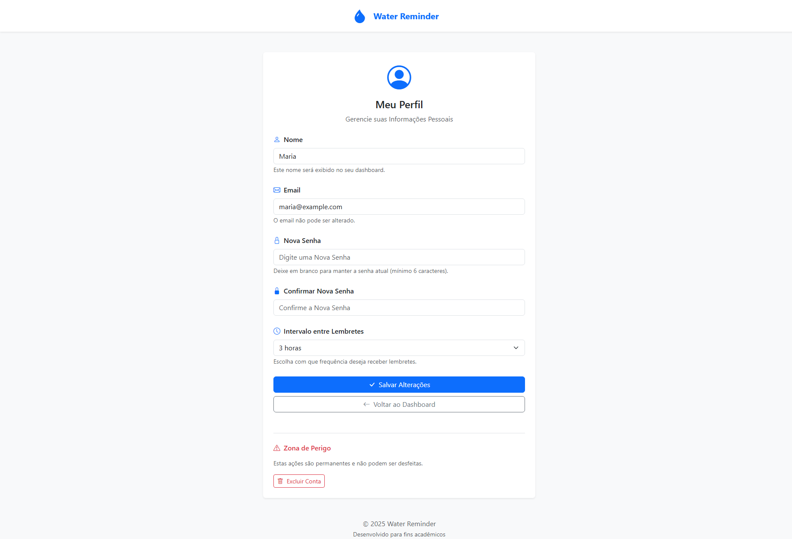
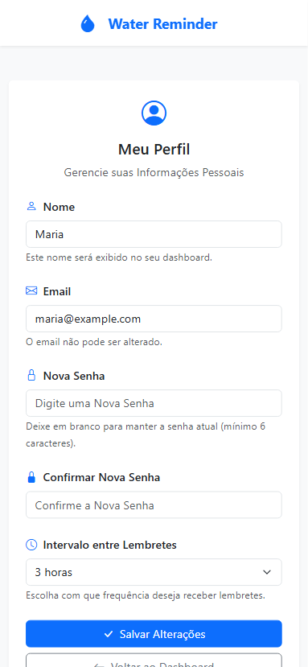
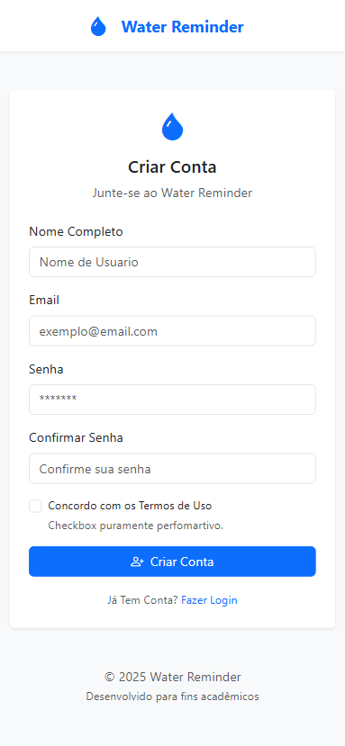
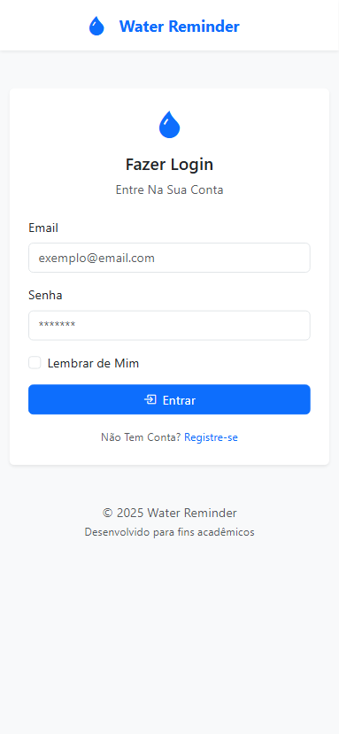

# 💧 Water Reminder

> Versão em Português  
[Clique Aqui!](README_pt.md)

## 📚 Overview

**Water Reminder** is a hydration tracking website that helps users maintain a healthy water intake routine. It logs the time of each drink, calculates the best time for the next sip based on a personalized interval, and keeps the user informed — encouraging well-being and consistent habits.

This project was designed and developed with a focus on learning **back-end with PHP**, serving as a practical experiment to apply concepts such as file manipulation, sessions, authentication, and business logic in a real context.

> This code was created for learning and personal development purposes. I'm more than happy if you use it as a base for your own studies, but I kindly ask that you give proper credit. Respecting each other's work and effort strengthens our dev community. 

## 📲 Features

* Logs the user's last sip of water.
* Automatically calculates the next reminder time based on a user-defined interval.
* Tracks streaks (consecutive days meeting the hydration goal).
* Allows secure user registration, login, and authentication.
* Provides a profile page for users to track their personal data.
* Fully responsive interface, working well on both mobile devices and desktops.
* Backend structured in PHP classes that handle authentication, registration, user data, and reminders.
* Uses a JSON file (`db.json`) as a simulated database for lightweight and efficient data storage.
* Simple and practical application focused on creating a healthy hydration habit.

#### ⚠️ Cookie Hash Security Disclaimer

In this project, the password hash may be visible in the browser cookies. I know this isn't secure for real-world applications, as exposing hashes in cookies could make attacks easier.

However, this is purely a learning project and not meant for production or handling sensitive data.
The main goal is to understand programming logic and basic authentication, not to implement robust security.

For real-world projects, always protect sensitive data properly — use secure tokens, HTTPS, and follow best security practices.

## 🛠️ Technologies Used

### ⚙️ **PHP**

PHP (Hypertext Preprocessor) is a widely-used server-side language for building dynamic web applications. In Water Reminder, PHP is responsible for all the back-end logic, including user authentication, session management, file reading and writing, reminder calculations, and hydration tracking. The project was designed as a hands-on learning experience, applying essential PHP concepts in a realistic scenario.

### 💻 **HTML + Bootstrap**

The entire interface was built using HTML and the Bootstrap framework — 100% of the styling and visual components rely solely on Bootstrap, with no custom CSS. The application is fully responsive, adapting automatically to different screen sizes (mobile, tablet, and desktop) to ensure a smooth user experience across all devices.

### 📖 **db.json**

The system uses a `db.json` file as a simulated database. This file stores persistent data such as user information, water intake times, and reminder settings. While it’s not a traditional relational database, it allows effective simulation of read/write operations, making it perfect for educational and prototyping purposes.

#### Data Model Example

```json
[
    {
        "id": 1,
        "nome": "Maria",
        "email": "maria@example.com",
        "senha": "$2y$10$\/nAx3hfS.4omPjuUFSrWwuBGZs.eZTQtUnY9WNf76aILdeXDP3puy",
        "intervalo": 10800,
        "streak": 1,
        "ultimoGole": "2025-08-07 18:05:46"
    }
]
```

## 🗃️ Main Folder Structure

```
└── 📁water-reminder-app
    └── 📁css
        ├── custom.css (empty)
    └── 📁db
        ├── db.json
    └── 📁includes
        ├── footer.php
        ├── header.php
    └── 📁pages
        ├── dashboard.php
        ├── index.php
        ├── login.php
        ├── logout.php
        ├── profile.php
        ├── register.php
    └── 📁php
        ├── Database.php
        ├── Login.php
        ├── Registro.php
        ├── Streak.php
        ├── Usuario.php
    └── 📁prints
        (...)
```

### 📌 Details

* The **`includes/`** folder stores files that are reused across multiple pages. This avoids code repetition, ensures visual consistency, and makes layout updates much easier — any change here is automatically reflected throughout the system.

* The **`pages/`** folder contains all the visible and interactive pages of the application. Each PHP file here represents a route or a UI feature, such as login, register, dashboard, user profile, and logout. These pages manage navigation flow, display data to users, and interact with the core logic classes.

* The **`php/`** folder holds all the business logic classes. These files contain methods for login, registration, user data handling, streak tracking, and interaction with `db.json`. This abstraction keeps the pages in the `pages/` folder clean and organized by delegating data processing to specialized classes.

## 🎛️ Interface

### 💻📱 Desktop & Mobile

#### Home Page

<div style="display: flex; flex-direction: row; gap: 20px; align-items: center;">
    
    
</div>

#### Dashboard

<div style="display: flex; flex-direction: row; gap: 20px; align-items: center;">
    
    
</div>

#### Profile

<div style="display: flex; flex-direction: row; gap: 20px; align-items: center;">
    
    
</div>

#### Registration

<div style="display: flex; flex-direction: row; gap: 20px; align-items: center;">
    
    
</div>

#### Login

<div style="display: flex; flex-direction: row; gap: 20px; align-items: center;">
    
    
</div>

