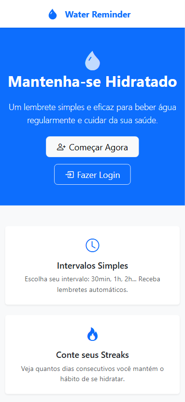
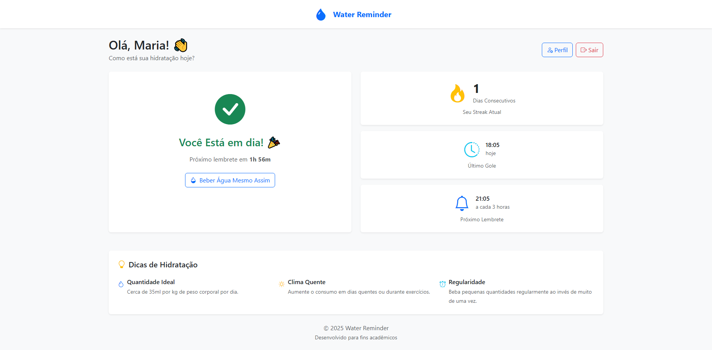
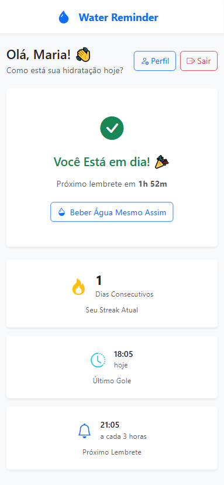
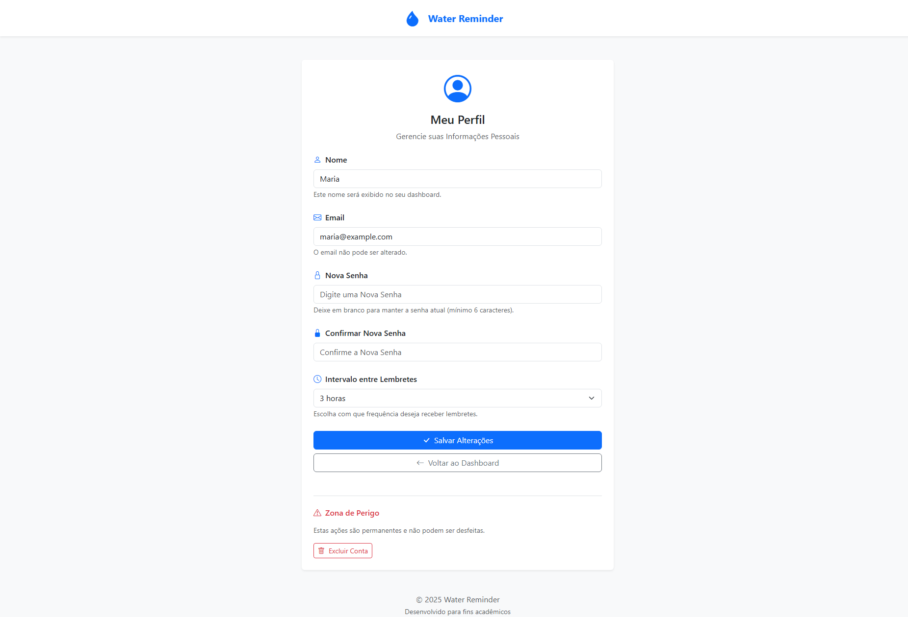
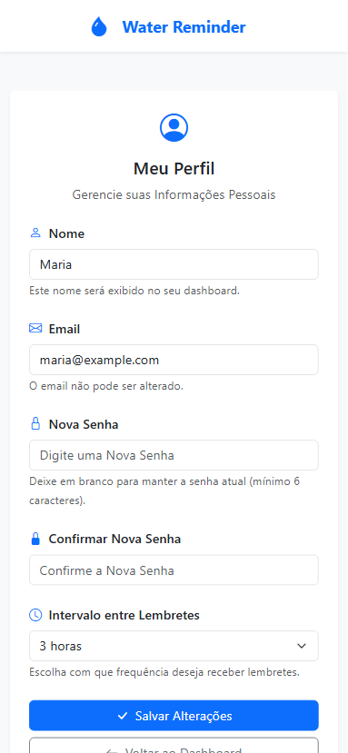
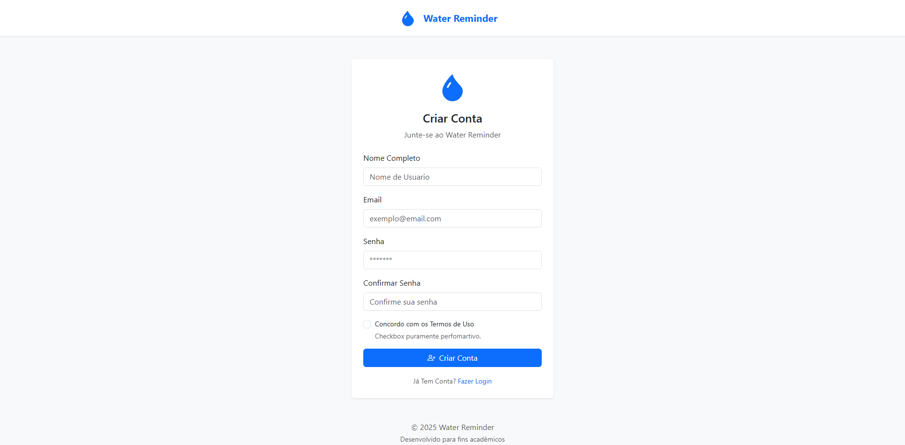
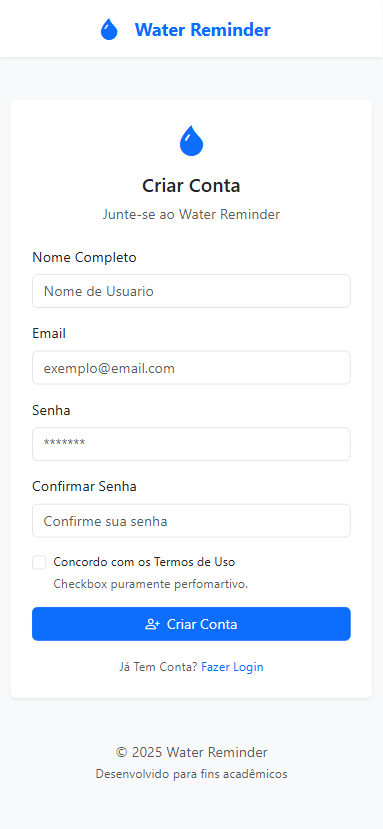
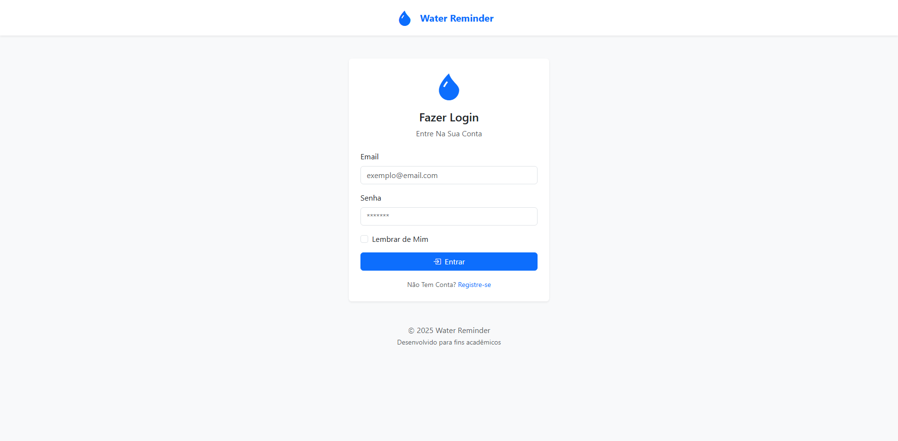
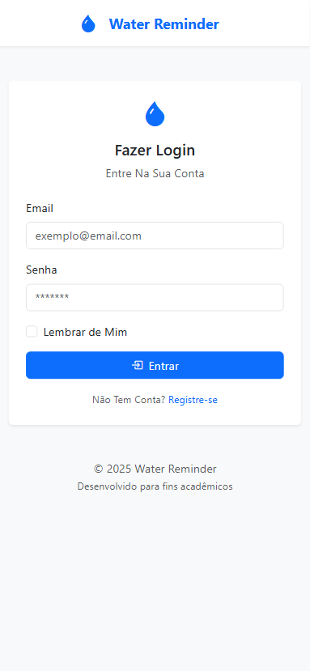

# 💧 Water Reminder

> English Version  
[Click Here!](README.md)

## 📚 Visão Geral

Water Reminder é um website de monitoramento de hidratação que ajuda os usuários a manterem uma rotina saudável de consumo de água. Ele registra o horário de ingestão, calcula o melhor momento para o próximo gole com base em um intervalo personalizado e mantém o usuário informado, incentivando o bem-estar e a regularidade do hábito.

O projeto foi idealizado e desenvolvido com foco em aprendizado de back-end com PHP, servindo como um experimento prático para aplicar conceitos como manipulação de arquivos, sessões, autenticação e lógica de negócios em um contexto real.

> Este código foi criado com o objetivo de aprendizado e desenvolvimento pessoal.   Ficarei muito feliz se você utilizar como base para seus estudos, mas peço gentilmente que dê os devidos créditos. Respeitar o trabalho e esforço de cada um fortalece nossa comunidade.

## 📲 Funcionalidades
- Registra o horário do último gole de água do usuário.
- Calcula automaticamente o horário do próximo lembrete com base no intervalo personalizado definido pelo usuário.
- Acompanhanamento de streaks (dias consecutivos cumprindo a meta).
- Permite cadastro, login e autenticação segura dos usuários.
- Disponibiliza página de perfil para o usuário acompanhar seus dados pessoais.
- Interface 100% responsiva, funcionando bem em dispositivos móveis e desktops.
- Backend organizado em classes PHP que gerenciam autenticação, registro, usuários e lembretes.
- Utiliza um arquivo JSON (`db.json`) como banco de dados simulado, para armazenamento leve e eficiente dos dados.
- Aplicação simples, prática e focada em criar um hábito saudável de hidratação diária.

#### ⚠️ Disclaimer Sobre Segurança do Hash nos Cookies
Neste projeto, o hash da senha pode ficar visível nos cookies do navegador. Sei que isso não é uma prática segura para aplicações reais, pois expor hashes em cookies pode facilitar ataques.

No entanto, este programa é apenas um exercício didático, que não manipula dados sensíveis de verdade nem está em produção.
O objetivo principal aqui é aprender a lógica de programação e o funcionamento básico de autenticação, não implementar uma segurança oficial ou robusta.

Para projetos reais, recomenda-se sempre proteger os dados sensíveis adequadamente, usar tokens seguros, HTTPS, e seguir boas práticas de segurança.

## 🛠️ Tecnologias Utilizadas
### ⚙️ **PHP**  
A linguagem PHP (Hypertext Preprocessor) é amplamente usada no desenvolvimento web para criação de aplicações dinâmicas do lado do servidor. No Water Reminder, o PHP é responsável por toda a lógica de back-end, incluindo autenticação de usuários, gerenciamento de sessões, leitura e escrita em arquivos, além de toda a lógica para cálculo de lembretes e controle da hidratação. O projeto foi pensado como um exercício de aprendizado prático com PHP, aplicando conceitos fundamentais da linguagem em um contexto real.

### 💻 **HTML + Bootstrap** 
Toda a interface do sistema foi construída utilizando HTML em conjunto com o framework Bootstrap — 100% das estilizações e componentes visuais utilizam exclusivamente Bootstrap, sem nenhuma linha de CSS personalizada. A aplicação é completamente responsiva, se adaptando automaticamente a diferentes tamanhos de tela (mobile, tablet e desktop), o que garante uma boa experiência do usuário em qualquer dispositivo.

### 📖 **db.json**  
O sistema utiliza um arquivo db.json como banco de dados simulado. Esse arquivo armazena dados persistentes, como informações de usuários, horários de ingestão de água e configurações de lembretes. Apesar de não ser um banco de dados relacional tradicional, ele permite a simulação eficaz de operações de leitura e escrita, sendo ideal para fins educacionais e prototipagem de projetos back-end.

#### Modelo de Dados

```json
[
    {
        "id": 1,
        "nome": "Maria",
        "email": "maria@example.com",
        "senha": "$2y$10$\/nAx3hfS.4omPjuUFSrWwuBGZs.eZTQtUnY9WNf76aILdeXDP3puy",
        "intervalo": 10800,
        "streak": 1,
        "ultimoGole": "2025-08-07 18:05:46"
    }
]
```

## 🗃️ Estrutura de Pastas Principal

```
└── 📁water-reminder-app
    └── 📁css
        ├── custom.css (vazio)
    └── 📁db
        ├── db.json
    └── 📁includes
        ├── footer.php
        ├── header.php
    └── 📁pages
        ├── dashboard.php
        ├── index.php
        ├── login.php
        ├── logout.php
        ├── profile.php
        ├── register.php
    └── 📁php
        ├── Database.php
        ├── Login.php
        ├── Registro.php
        ├── Streak.php
        ├── Usuario.php
    └── 📁prints
        (...)
```

### 📌 Detalhamento

- A pasta **`includes/`** centraliza os arquivos que são incluídos de forma recorrente em diferentes páginas do sistema. Isso evita repetição de código, promove consistência visual entre as páginas e facilita a manutenção do layout, já que qualquer alteração feita nesses arquivos se propaga automaticamente por todo o sistema.

- A pasta **`pages/`** reúne as páginas visíveis e interativas da aplicação. Cada arquivo PHP nessa pasta representa uma rota ou uma funcionalidade da interface do sistema, como login, registro, dashboard, perfil do usuário e logout. Essas páginas são responsáveis por controlar o fluxo de navegação, exibir os dados ao usuário e interagir com as classes da aplicação, funcionando como a camada de controle e apresentação do sistema.

- A pasta **`php/`** concentra as classes responsáveis pela lógica e funcionalidades centrais do sistema. Esses arquivos encapsulam métodos para login, registro, manipulação de dados do usuário, controle de streaks e comunicação com o db.json. Ou seja, toda a lógica de negócio está abstraída aqui, permitindo que as páginas da pasta pages/ se mantenham organizadas, delegando o processamento de dados para essas classes especializadas.

## 🎛️ Interface

### 💻📱 Desktop & Mobile

#### Página Inicial
<div style="display: flex; flex-direction: row; gap: 20px; align-items: center;">
    
    
</div>

#### Dashboard
<div style="display: flex; flex-direction: row; gap: 20px; align-items: center;">
    
    
</div>

#### Perfil
<div style="display: flex; flex-direction: row; gap: 20px; align-items: center;">
    
    
</div>

#### Registro
<div style="display: flex; flex-direction: row; gap: 20px; align-items: center;">
    
    
</div>

#### Login
<div style="display: flex; flex-direction: row; gap: 20px; align-items: center;">
    
    
</div>